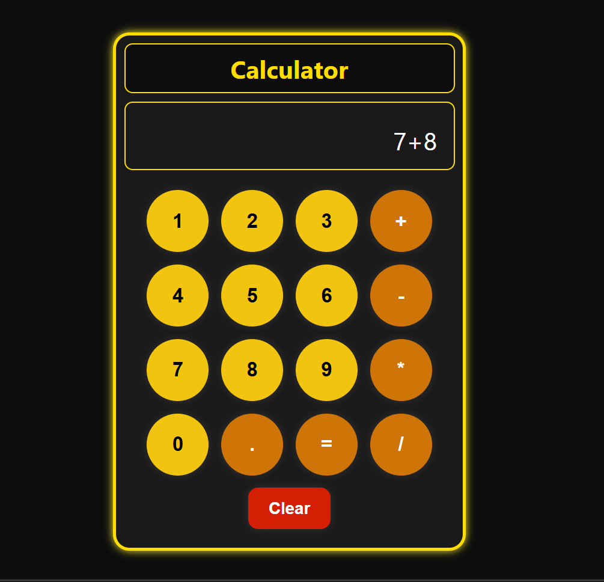

# 🧮 Calculator

A simple and responsive calculator built using **HTML**, **CSS**, and **JavaScript**.  
Perform basic arithmetic operations with a sleek, interactive interface!

---

## 🚀 Features

- ➕ Perform basic arithmetic operations (Addition, Subtraction, Multiplication, Division)
- 💾 Calculation history is stored using **localStorage**
- 🎨 Beautiful and responsive UI – works on both desktop and mobile
- 🔴 **Clear** button to reset the calculations at any time

---

## 🔧 Tech Stack

- **HTML** – Structure  
- **CSS** – Styling and Layout  
- **JavaScript** – Logic and Interactivity

---

## 📸 Screenshots

---

## 🧠 How to Use

1. Click on the number keys (1-9) and operator buttons (+, -, *, /) to perform calculations.
2. Press the **Clear** button to reset the calculation.
3. Click **=** to compute and display the result.

---

